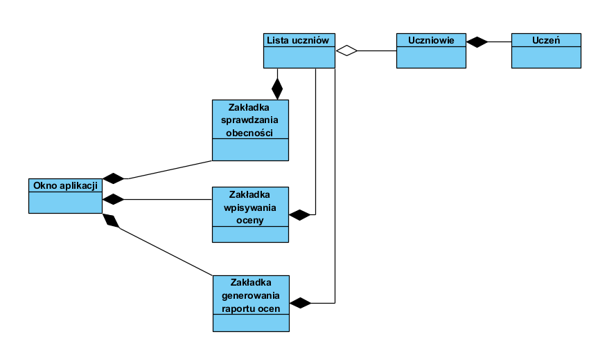

# PZ_2019_Lab2_Gr2
# Dziennik elektroniczny
## Aplikacja spełniajaca zadania dziennika elektronicznego przygotowana na zajęcia z programowania zespołowego.

## Spis treści:
1. Cel systemu,
2. Potencjalni użytkownicy systemu,
3. Informacje gromadzone przez system,
4. Informacje generowane przez system,
5. Uprawnienia użytkowników,
6. Autorzy aplikacji,
7. Licencja,
8.Schematy UML systemu.

#### 1. Cel systemu: 
*System ma spełniac podstawowe zadania, dziennika tradycyjnego - papierowego w elektronicznej wersji.
Aplikacja pozwoli na sporządzanie listy obecności uczniów na zajęciach, dodawanie ocen, gromadzenie uwag odnośnie
zachowania uczniów, przechowywania informacji o planie zajęć,wydruk planu zajęć, generowanie wykazów ocen*

#### 2. Potencjalni użytkownicy systemu:
*System dedykowany jest dla szkół dlatego też grupy użytkowników w nim występujące są specyficzne.
W systemie wyróznimu takich użytkowników jak administrator, który zarządza całą aplikacją, nauczyciele sprawójący 
opiekę nad uczniami oraz samych uczniów.*

#### 3. Informacje gromadzone przez system:
*System gromadzi informacje o uczniach a właściwie o winikach ich nauczania. Przechowuje oceny wystawione przez nauczycieli
z danych przedmiotów. System pozwala na odnotowanie frekwencji uczniów na zajęciach. Kożystający z systemu użytkownicy mogą 
sprawdzać zaplanowane zajęcia.*

#### 4. Informacje generowane przez system:
*Aplikacja pozwoli nauczycielowi na generowanie raportów dotyczących wyników osiąganych przez uczniów, które pozniej
może przedstawić na spotkaniu z opiekunami ucznia. Aplikacja pozwoli także uczniowi na wydrukowanie
w postaci dokumentu pdf planu zajęć.*

#### 5. Uprawnienia użytkowników:
*W systemie największe uprawnienia posiada administrator, zarządza on kontami użytkowników (modyfikuje/usuwa/tworzy nowe).
Administrator może także modyfikować błędy w danych popełnione przez nauczyciela. Drugą grupą w hierarchii uprawnień są nauczyciele.
Mają oni dostęp do panelów zarządzania ocenami, obecnościami, uwagami, po przez które wprowadzają informacje do systemu.
Uczniowie w systemie mogą jedynie podgladać sysuacje swoich ocen, obecności, uwag oraz wyświetlać plan zajęć.*

#### 6.Autorzy aplikacji:
- Patrycja Nędza
- Adam Marzec
- Damian Wawrzkowicz
- Andrzej Sabat

#### 7.Licencja

Aplikacją jest objęta licencją MIT.

#### 8. Schematy UML systemu:
- diagram przypadków użycia

- diagram klas
 
 
 
 
 
 - diagram aktywności
 
 
 
 - diagram sekwencji

